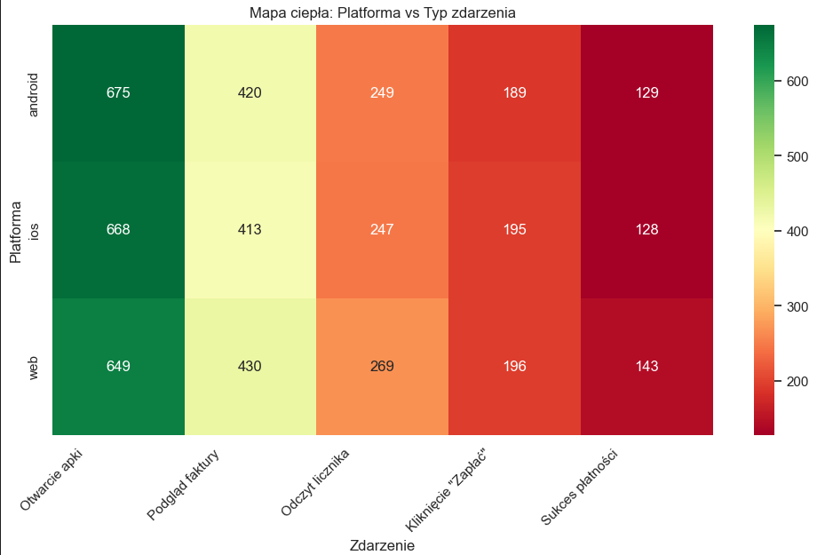

# Tauron-Product-Analytics
Product Analytics Case Study: Utility App Conversion Funnel

## 📌 Project Overview
This analysis focuses on optimizing the payment funnel for a large utility provider's mobile and web application. Using Python and Pandas, I processed 5,000 synthetic event logs to simulate real-world product telemetry and identify why users fail to complete payments.

## 🛠 Tech Stack
- **Language:** Python 3.x
- **Libraries:** Pandas (Data manipulation), NumPy (Synthetic data generation), Seaborn & Matplotlib (Visualization).

## 📊 Key Findings (Insights)
1. **Funnel Performance:** The overall conversion rate from app opening to successful payment is **55.46%**.
2. **Platform Discrepancy:** Users on **iOS (24.43% CR)** convert significantly better than those on the **Web portal (16.00% CR)**. 
3. **Behavioral Patterns:** The data shows a 40% drop-off at the "enter_meter_reading" stage, suggesting potential UX friction in manual data entry.

## 💡 Recommendations
- **UX Audit for Web:** Prioritize a user experience audit for the browser version of the app to bridge the 8% gap in conversion compared to iOS.
- **Simplify Meter Reading:** Implement OCR (optical character recognition) or simplify the meter reading form to reduce drop-offs before the payment stage.
- **Android Stability Check:** Android has the highest volume of sessions but lower conversion than iOS; technical stability during the "click_pay" event should be verified.

## 📁 Dataset
The dataset used in this analysis is synthetically generated to mimic real-world utility app logs. 
It contains 5,000 events with the following structure:
- `user_id`: Unique identifier for each customer.
- `event_name`: Type of action performed (app_open, view_invoice, payment_success, etc.).
- `platform`: Device type (Android, iOS, Web).
- `timestamp`: Date and time of the event.

You can find the raw data in [user_activity.csv](./user_activity.csv).
